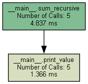

[![badge](https://img.shields.io/badge/launch-binder-579aca.svg?logo=)](https://mybinder.org/v2/gh/FZJ-IEK3-VSA/voila-tsam/HEAD?urlpath=voila/render/Time-Series-Aggregation-Module.ipynb)

<a href="https://www.fz-juelich.de/en/iek/iek-3"></a> 

# callgraphwrapped
callgraphwrapped is a simple python package that enables users to easily visualize their python code structure. callgraphwrapped takes standard [call graph](http://en.wikipedia.org/wiki/Call_graph) python packages a step further by allowing users to create a visual from only the functions they select. Users simply wrap the functions they wish to include with a pre-defined wrapper and callgraphwrapped generates an image based on their connections. 

## Features
* Call graph visualization of selected python functions in a PNG format
* Includes the time spent running selected functions and the number of calls to selected functions
* Color coded call graph image, based on the time spent running function calls
* Optional profiling of selected functions using cProfile

## Installation
Directly install via pip as follows:

	pip install callgraphwrapped

Alternatively, clone a local copy of the repository to your computer:

	git clone https://github.com/FZJ-IEK3-VSA/callgraphwrapped

Then install callgraphwrapped via pip as follows:

	cd callgraphwrapped
	pip install .

Finally, run the unit tests to ensure it is installed correctly:

    python -m unittest test.test_store_calls
    python -m unittest test.test_store_funcs


## Basic Workflow

A small example how to use callgraphwrapped is as follows:
```python
import cProfile
from callgraphwrapped.wrapper import MethodChart, register_method
```

Enable the profiler (optional):
```python
profiler = cProfile.Profile()
profiler.enable()
```

Define the call graph object. The execute function contains all the scripts or functions you wish to include in the graph. Scripts and functions do not need to be a part of the PyCallGraphObject class but all functions included in the call graph must be wrapped with the **@register_method** wrapper:
```python
class PyCallGraphObject:

    def __init__(self) -> None:
        self.execute()
        methodchart = MethodChart()
        methodchart.make_graphviz_chart(
            time_resolution=3, filename="Method_Pattern.png"
        )
        profiler.disable()
        profiler.dump_stats("profile.prof")

    def execute(self):
        self.sum_recursive(3, 4)

    @register_method
    def sum_recursive(self, a, b):
        if b > 0:
            a += 1
            b -= 1
            self.print_value(prefix='current', value=a)
            return self.sum_recursive(a, b)
        else:
            self.print_value(prefix='final', value=a)
            return a
    
    @register_method
    def print_value(self, prefix, value):
        print("{} value = {}".format(prefix,value))
```

Finally run the code by initializing the PyCallGraphObject:
```python
run = PyCallGraphObject()
```

If created succesfully, the resulting graph looks like:



### Including functions from other directories and scripts

To include functions from other python files and scripts, simply import the wrapper into your script as follows:
```python
from callgraphwrapped.wrapper import register_method
```

And wrap the desired functions. callgraphwrapped will automatically locate it when creating the call graph:
```python
@register_method
def myExampleFunction(a, b):
    ....
```

## Detailed Example

A detailed example of what can be created with callgraphwrapped was generated for one module of the House Infrastructure Simulator [(HiSim)](https://github.com/FZJ-IEK3-VSA/HiSim).


## License

MIT License

Copyright (c) 2022-2023 Katharina Rieck (FZJ/IEK-3), Matthew Keller (FZJ/IEK-3), Noah Pflugradt (FZJ/IEK-3), Jann Weinand (FZJ/IEK-3), Detlef Stolten (FZJ/IEK-3)

You should have received a copy of the MIT License along with this program.
If not, see https://opensource.org/licenses/MIT


## About Us

We are the [Institute of Energy and Climate Research - Techno-economic Systems Analysis (IEK-3)](https://www.fz-juelich.de/en/iek/iek-3) belonging to the [Forschungszentrum Jülich](https://www.fz-juelich.de/en). Our interdisciplinary department's research is focusing on energy-related process and systems analyses. Data searches and system simulations are used to determine energy and mass balances, as well as to evaluate performance, emissions and costs of energy systems. The results are used for performing comparative assessment studies between the various systems. Our current priorities include the development of energy strategies, in accordance with the German Federal Government’s greenhouse gas reduction targets, by designing new infrastructures for sustainable and secure energy supply chains and by conducting cost analysis studies for integrating new technologies into future energy market frameworks.


## Acknowledgments

* To create the singleton pattern, the following work was referenced:
    https://refactoring.guru/design-patterns/singleton/python/example#example-1

* callgraphwrapped makes use of the [python graphviz](https://pypi.org/project/graphviz/) package.
